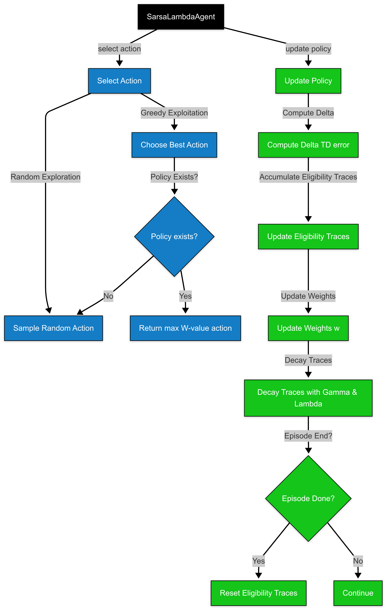
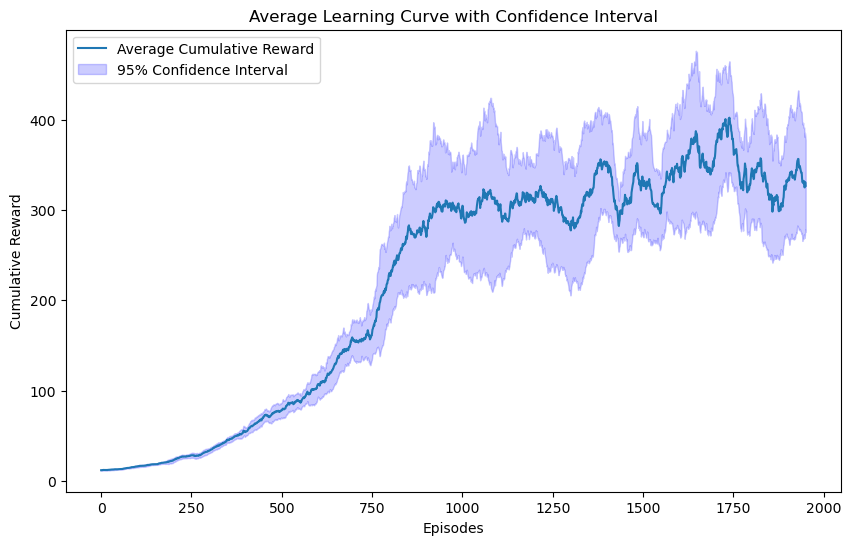

<h1 align="center">Flappy Bird : Reinforcement Learning</h1>

  

    <a href="#introduction">Introduction</a> •
    <a href="#agents">Agents</a> •
    <a href="#results">Results</a> •
    <a href="#conclusion">Conclusion</a>

## Introduction  

With the emergence of artificial intelligence, we have seen the development of algorithms capable of outperforming humans in various video games. In this context, we apply two well-known reinforcement learning agents on the FlappyBird game to create agents capable of navigating the bird through pipes without crashing. The two agents used are **Monte Carlo (MC)** and **Sarsa(λ)**, which employ different approaches to update their policies.

The environment used is **TextFlappyBird-v0**, which is an adapted version of the OpenAI Gym. There are two variants of this environment:
- **TextFlappyBird-screen-v0**: Provides a full-screen render with visual details but requires more computational resources.
- **TextFlappyBird-v0**: Provides a simpler observation with numerical values representing the distance to the upcoming pipe, making it more computationally efficient but potentially missing critical visual cues for more complex decision-making.

## Agents

### Monte Carlo Agent

The **Monte Carlo (MC)** agent is a reinforcement learning algorithm that learns the value of state-action pairs based on experiences obtained from interactions with the environment. It updates its estimates of state-action values (Q-values) after completing an episode, using the actual returns (cumulative rewards) from that episode. The agent typically uses an **ϵ-greedy policy** to balance exploration and exploitation.

**Update Equation**:
The Monte Carlo update rule for Q-values is:

$$
Q(s_t, a_t) \leftarrow Q(s_t, a_t) + \alpha \left(G_t - Q(s_t, a_t)\right)
$$

Where:
- $s_t$ is the state at time $t$,
- $a_t$ is the action taken at time $t$,
- $G_t$ is the return (total discounted reward) starting from $t$,
- $\alpha$ is the learning rate.

The agent updates its policy by selecting the action with the highest Q-value for each state.

The functions `select_action` and `update_policy` of this agent are used as follow :

  

### Sarsa(λ) Agent

The **Sarsa(λ)** agent is an on-policy reinforcement learning algorithm that uses eligibility traces to speed up learning by giving credit to states and actions that contributed to an outcome. It combines **Temporal Difference (TD)** learning with eligibility traces, where **λ** controls how much past states and actions are updated. It also uses an **ϵ-greedy policy**.

**Update Equation**:
The Sarsa(λ) update rule is:

$$
w(s_{t+1}, a_{t+1}) \leftarrow w(s_t, a_t) + \alpha \delta_t z_t(s_t, a_t)
$$

Where:
- $w(s_t, a_t)$ is the weight associated with the state-action pair $(s_t, a_t)$,
- $\delta_t = r_{t+1} + \gamma w(s_{t+1}, a_{t+1}) - w(s_t, a_t)$ is the TD error at time $t$,
- $\alpha$ is the learning rate,
- $z_t(s_t, a_t)$ is the eligibility trace for the state-action pair $(s_t, a_t)$,
- $\gamma$ is the discount factor.

The eligibility trace is updated at each time step by:

$$
z_t(s_t, a_t) = \gamma \lambda z_{t-1}(s_t, a_t) + 1
$$

This trace decays by the factor $\gamma \lambda$, and if the episode ends, the eligibility traces are reset.

The functions `select_action` and `update_policy` of this agent are used as follow:

  

## Results

### Monte Carlo Agent

The **Monte Carlo agent** constructs a Q-matrix without approximation, which can lead to unknown action-state pairs and noisy results.

- Parameters used: $ \gamma = 0.96 $, $ \alpha = 0.2 $, and $ \epsilon $ with a decay of 0.995.
- The agent was trained over 2000 episodes.

**Cumulative Reward**: The performance improves in the first 1000 episodes but becomes noisier after that.

**Q-Matrix**: The Q-matrix, displayed below, shows the agent’s decision-making. The heatmaps reveal that the bird flaps when near the ground and doesn't flap when high in the air.

**Score Distribution**: The distribution of scores for 2000 games, revealing that the agent performs best in games with scores between 0 and 200, with fewer games surpassing this threshold.

**Average Cumulative Reward**: After 10 runs, the average cumulative reward is shown below, demonstrating that the performance starts declining after 1000 episodes.

  

### Sarsa(λ) Agent

The **Sarsa(λ) agent** approximates a state-action matrix, with all actions known, but a better approximation is needed to achieve good performance.

- Parameters used: $ \gamma = 0.95 $, $ \alpha = 0.2 $, $ \lambda = 0.96 $, and $ \epsilon $ with a decay of 0.995.
- The agent was trained over 2000 episodes.

**Cumulative Reward**: The performance improves slowly in the first 1000 episodes, but accelerates after that.

**W-Matrix**: The W-matrix, displayed below, shows that the agent follows a more binary decision-making process, with red zones representing the areas where it either flaps or not.

**Score Distribution**: The distribution of scores for 2000 games, and it resembles the Monte Carlo agent's distribution.

**Average Cumulative Reward**: As shown below, the performance continues to increase, albeit slowly, and further episodes might improve performance.

  

## Conclusion

Both agents successfully learned to play FlappyBird, but they exhibited different learning behaviors. The Monte Carlo agent had noisier performance due to its episodic updates, while the Sarsa(λ) agent showed smoother learning due to its step-by-step updates. Ultimately, the **Monte Carlo agent** provided better performance with an average cumulative reward of 350, compared to **Sarsa(λ)**’s reward of 250.

**Limitations**: The Monte Carlo agent converged with a lot of noise due to its slow update policy, while Sarsa(λ) converged more slowly but was smoother. For further improvement, we could consider:
- Selecting the agent with the highest cumulative reward at the end of training,
- Implementing a lambda decay for the Sarsa(λ) agent,
- Adding velocity information to the input state.

It is important to note that all games are independent, meaning that agents need to generalize their strategies, which can introduce noise into their learning.

